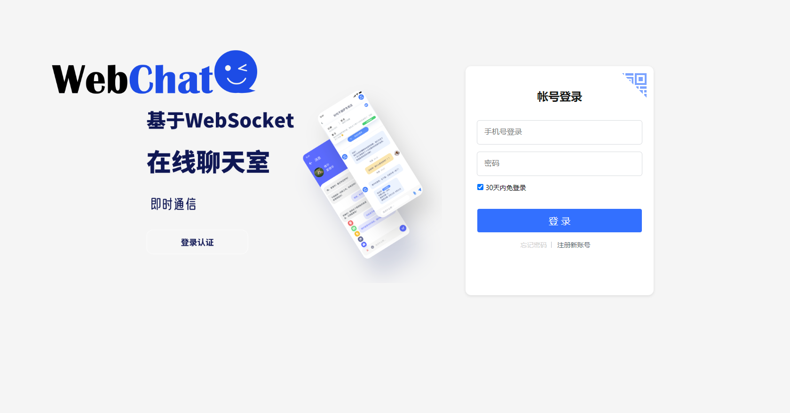
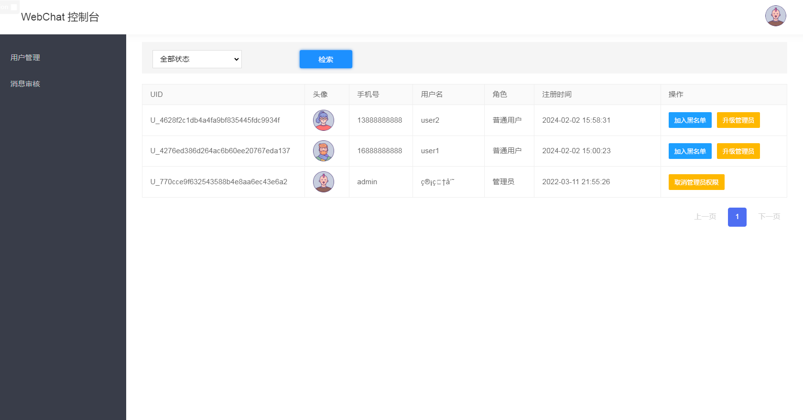

<div id="readme-top" ></div>
<div align="center">


Web Chat is an open-source chat system, supporting one-click free deployment of private Chat web applications.

**English** · [简体中文](./README.md)  · [Report Issues][github-issues-link] · [Request Features][github-issues-link]

<!-- SHIELD GROUP -->

[![][github-release-shield]][github-release-link]
[![][docker-release-shield]][docker-release-link]

[![][github-forks-shield]][github-forks-link]
[![][github-stars-shield]][github-stars-link]
[![][github-issues-shield]][github-issues-link]
[![][github-license-shield]][github-license-link]

**Share WebChat with your friends**

[![][share-telegram-shield]][share-telegram-link]
[![][share-weibo-shield]][share-weibo-link]






</div>
<details>
<summary><kbd>Table of Contents</kbd></summary>

#### TOC

- [👋🏻 Getting Started & Communication](#-getting-started--communication)
- [🛳 Ready to Use](#-ready-to-use)
    - [`A` Deployment with Docker](#a-deployment-with-docker)
    - [`B` Deployment with Docker-compose](#b-deployment-with-docker-compose)
    - [`C` Local Deployment with Jar Package](#c-local-deployment-with-jar-package)
- [⌨️ Local Development](#️-local-development)
- [🤝 Contributing](#-contributing)
- [🔗 More Tools](#-more-tools)

####

<br/>

</details>

## 👋🏻 Getting Started & Communication

The current online version of WebChat: https://webchat.superxiang.com 
For requirements or problems, feel free to submit [issues][issues-link]

| [![][chat-shield-badge]][chat-link]       | Visit WebChat for quick experience                                  |
|:------------------------------------------|:------------------------------------------------|
| [![][discord-shield-badge]][discord-link] | Join our Discord community! This is where you can communicate with developers and other WebChat enthusiasts |
| [![][qq-shield-badge]][qq-link]           | Join our QQ group! Welcome to discuss development                               |

> **Star the project**, you will receive all release notifications from GitHub with no delay～⭐️

## 🛳 Ready to Use
> For detailed instructions on Docker deployment, see [📘 Deploy with Docker](https://github.com/loks666/webchat/wiki/Docker-Deployment.zh-CN)  
<br/>
WebChat provides a [Docker image][docker-release-link], allowing you to build your own chat service in minutes without any basic knowledge.  
> 
This project currently has three tags, namely latest, customer and v1.0  
1. latest: The packaging method is to put in the jar package, so it does not support modifying the configuration: the passwords of mysql and redis are both loks666, and the mysql user is root  
2. customer: The packaging method is dockerfile packaging, which supports modifying the configuration: you can modify the configuration of mysql and redis and need to add the following configuration

  ```fish
     volumes:
       - ./webchat/application.yml:/src/main/resources/application.yml
       - ./webchat/application-dev.yml:/src/main/resources/application-dev.yml
  ```
3. v1.0: For ancient versions, it can be ignored  
---
> The database initialization script for this project is located in sql/webcaht.sql. It can be directly imported into MySQL, or you can use docker-compose for one-click deployment, which will automatically initialize the database.

> There will be three initial users; admin (administrator), user1 (ordinary user), and audit2 (ordinary user). The password for all these users is 123456.

<br/>

### `A` Deployment with Docker

We provide a Docker image for you to deploy the WebChat service on your own private device. Use the following command to start the WebChat service with one click:
```fish
docker run -d --name webchat -p 8101:8101 general9527/webchat:customer
```
Note: Please change your database root password and redis to loks666, so the program can use it correctly. If your mysql and redis are started using containers, you need to use the --network option to specify the network.

```fish
docker run -d --name webchat --network ‘your network name’ -p 8101:8101 general9527/webchat:customer
```
### `B` Deployment with Docker-compose

[![][docker-release-shield]][docker-release-link]
[![][docker-size-shield]][docker-size-link]
[![][docker-pulls-shield]][docker-pulls-link]  


- Use docker-compose in the project root directory for one-click deployment (recommended)  
Note: One-click deployment includes redis and mysql services, please check whether these two services exist before deployment

```fish
    cd webchat
    docker-compose up -d
```
- Webchat standalone deployment (in the case of existing mysql and redis)

```fish
    version: '3.8'
    volumes:
      mysql:
      redis:
    
    services:
      webchat:
        image: general9527/webchat:customer
        container_name: webchat
        ports:
          - "8101:8101"
        volumes:
          - ./webchat/application.yml:/src/main/resources/application.yml
          - ./webchat/application-dev.yml:/src/main/resources/application-dev.yml
        networks:
          - chat_network
    
    networks:
      chat_network:
        name: chat_network
```
Before deployment, please change the configuration of redis and mysql in application-dev.yml to your own configuration

### `C` Local Deployment with Jar Package
> It is recommended to use the Idea plugin to compile and package. If you use commands, you need to configure the maven environment into the system environment variables.
```fish
    cd webchat
    mvn clean package
    java -jar webchat.jar
```
<br/>


## ⌨️ Local Development

Use the following commands for local development:

```fish
$ git clone https://github.com/loks666/webchat.git
$ cd webchat
$ mvn claen install
$ java -jar webchat.jar
```

<div style="text-align:right">


</div>

## 🤝 Contributing

We warmly welcome all forms of contributions. If you are interested in contributing code, you can check out our GitHub [Issues][github-issues-link]
and [Projects][github-project-link], show off your ideas and talents.

[![][pr-welcome-shield]][pr-welcome-link]

----

## 🔗 More Tools

- [🌏 Guide][guide] : Website navigation, the homepage includes all the works and services of the author
- [🤯 Fly AI][Fly AI] : An AI website that can be used without magic, supporting the application of ChatGPT/LLM models. As well as midjourney drawing and other functions
- [💌 Fly API][flyapi] : A distribution website for Open AI API KEY, you can share your key with others

<div style="text-align:right">

[![][back-to-top]](#readme-top)

</div>

---

<details><summary><h4>📝 License</h4></summary>

[![][fossa-license-shield]][fossa-license-link]

</details>

Copyright © 2023 [WebChat][profile-link]. <br />
This project is [MIT](./LICENSE) licensed.

[github-release-shield]: https://img.shields.io/github/v/release/loks666/webchat?color=369eff&labelColor=black&logo=github&style=flat-square

[docker-release-link]: https://hub.docker.com/repository/docker/general9527/webchat/general

[docker-release-shield]: https://img.shields.io/docker/v/general9527/webchat?color=369eff&labelColor=black&logo=docker&style=flat-square

[github-forks-link]: https://github.com/loks666/webchat/network/members

[github-forks-shield]: https://img.shields.io/github/forks/loks666/webchat?color=blue&labelColor=black&style=flat-square

[github-stars-link]: https://github.com/loks666/webchat/stargazers

[github-stars-shield]: https://img.shields.io/github/stars/loks666/webchat?color=ffcb47&labelColor=black&style=flat-square

[github-issues-link]: https://github.com/loks666/webchat/issues

[github-issues-shield]: https://img.shields.io/github/issues/loks666/webchat?color=red&labelColor=black&style=flat-square

[github-license-link]: https://github.com/loks666/webchat/blob/main/LICENSE

[github-license-shield]: https://img.shields.io/github/license/loks666/webchat?color=green&labelColor=black&style=flat-square

[back-to-top]: https://img.shields.io/badge/-BACK_TO_TOP-151515?style=flat-square

[codespaces-link]: https://codespaces.new/loks666/webchat

[codespaces-shield]: https://github.com/codespaces/badge.svg

[discord-link]: https://discord.gg/gFxrcWhR

[qq-link]: https://qm.qq.com/cgi-bin/qm/qr?_wv=1027&k=547c2h6ymkB5b1WtWUBuTTJUb9Y5mh22&authKey=x3fgiRXNFNAkatyJG8%2Fyx9GAyz%2FOAnKHi%2FG3AOYhc2Ry1NKBakmuWU6BlhcGNX1M&noverify=0&group_code=134077083

[discord-shield-badge]: https://img.shields.io/discord/1127171173982154893?color=5865F2&label=discord&labelColor=black&logo=discord&logoColor=white&style=for-the-badge

[qq-shield-badge]: https://img.shields.io/badge/%E4%BA%A4%E6%B5%81%E7%BE%A4-123456789?color=5865F2&label=QQ&labelColor=black&logo=tencent-qq&logoColor=white&style=for-the-badge

[docker-pulls-link]: https://hub.docker.com/repository/docker/general9527/webchat/general

[docker-pulls-shield]: https://img.shields.io/docker/pulls/general9527/webchat?color=45cc11&labelColor=black&style=flat-square

[docker-size-link]: https://hub.docker.com/r/docker/general9527/webchat/general

[docker-size-shield]: https://img.shields.io/docker/image-size/general9527/webchat/latest?color=369eff&labelColor=black&style=flat-square


[fossa-license-link]: https://app.fossa.com/projects/git%2Bgithub.com%2Floks666%2Fwebchat/refs/branch/master/1ea8120312c4f9353a98c691784dc90576123695

[fossa-license-shield]: https://app.fossa.com/api/projects/git%2Bgithub.com%2Flobehub%2Flobe-chat.svg?type=large

[github-action-release-link]: https://github.com/loks666/webchat/actions/workflows/release.yml

[github-action-release-shield]: https://img.shields.io/github/actions/workflow/status/loks666/webchat/release.yml?label=release&labelColor=black&logo=githubactions&logoColor=white&style=flat-square

[github-action-test-link]: https://github.com/loks666/webchat/actions/workflows/test.yml

[github-action-test-shield]: https://img.shields.io/github/actions/workflow/status/loks666/webchat/test.yml?label=test&labelColor=black&logo=githubactions&logoColor=white&style=flat-square

[github-contributors-link]: https://github.com/loks666/webchat/graphs/contributors

[github-contributors-shield]: https://img.shields.io/github/contributors/loks666/webchat?color=c4f042&labelColor=black&style=flat-square

[github-forks-link]: https://github.com/loks666/webchat/network/members

[github-forks-shield]: https://img.shields.io/github/forks/loks666/webchat?color=8ae8ff&labelColor=black&style=flat-square

[github-issues-link]: https://github.com/loks666/webchat/issues

[github-issues-shield]: https://img.shields.io/github/issues/loks666/webchat?color=ff80eb&labelColor=black&style=flat-square

[github-license-link]: https://github.com/loks666/webchat/blob/main/LICENSE

[github-license-shield]: https://img.shields.io/github/license/loks666/webchat?color=white&labelColor=black&style=flat-square

[github-project-link]: https://github.com/loks666/webchat/projects

[github-release-link]: https://github.com/loks666/webchat/releases/tag/latest

[github-releasedate-link]: https://github.com/loks666/webchat/releases

[github-releasedate-shield]: https://img.shields.io/github/release-date/loks666/webchat?labelColor=black&style=flat-square

[github-stars-link]: https://github.com/loks666/webchat/network/stargazers

[github-stars-shield]: https://img.shields.io/github/stars/loks666/webchat?color=ffcb47&labelColor=black&style=flat-square

[github-wiki-link]: https://github.com/loks666/webchat/wiki

[issues-link]: https://img.shields.io/github/issues/loks666/webchat.svg?style=flat

[flyapi]: https://fly.superxiang.com/

[Fly AI]: https://ai.superxiang.com

[guide]: https://guide.superxiang.com

[pr-welcome-link]: https://github.com/loks666/webchat/pulls

[pr-welcome-shield]: https://img.shields.io/badge/🤯_pr_welcome-%E2%86%92-ffcb47?labelColor=black&style=for-the-badge

[profile-link]: https://github.com/loks666/webchat

[share-telegram-link]: https://t.me/share/url?text=%E6%8E%A8%E8%8D%90%E4%B8%80%E4%B8%AA%20GitHub%20%E5%BC%80%E6%BA%90%E9%A1%B9%E7%9B%AE%20%F0%9F%A4%AF%20WecChat%20-%20%E5%BC%80%E6%BA%90%E7%9A%84%E8%81%8A%E5%A4%A9%E7%BD%91%E9%A1%B5%E5%BA%94%E7%94%A8%E3%80%82%20%E5%AE%83%E6%94%AF%E6%8C%81%E4%B8%80%E9%94%AE%E5%85%8D%E8%B4%B9%E9%83%A8%E7%BD%B2%E7%A7%81%E4%BA%BA%E7%BD%91%E9%A1%B5%E5%BA%94%E7%94%A8%E7%A8%8B%E5%BA%8F%20%23chat%20%23IM%20%23wecChat%20%23websocket&url=https%3A%2F%2Fgithub.com%2Floks666%2Fwebchat

[share-telegram-shield]: https://img.shields.io/badge/-share%20on%20telegram-black?labelColor=black&logo=telegram&logoColor=white&style=flat-square

[share-weibo-link]: https://service.weibo.com/share/share.php?sharesource=weibo&title=%E6%8E%A8%E8%8D%90%E4%B8%80%E4%B8%AA%20GitHub%20%E5%BC%80%E6%BA%90%E9%A1%B9%E7%9B%AE%20%F0%9F%A4%AF%20WecChat%20-%20%E5%BC%80%E6%BA%90%E7%9A%84%E8%81%8A%E5%A4%A9%E7%BD%91%E9%A1%B5%E5%BA%94%E7%94%A8%E3%80%82%20%E5%AE%83%E6%94%AF%E6%8C%81%E4%B8%80%E9%94%AE%E5%85%8D%E8%B4%B9%E9%83%A8%E7%BD%B2%E7%A7%81%E4%BA%BA%E7%BD%91%E9%A1%B5%E5%BA%94%E7%94%A8%E7%A8%8B%E5%BA%8F%20%23chat%20%23IM%20%23wecChat%20%23websocket&url=https%3A%2F%2Fgithub.com%2Flobehub%2Flobe-chat#_loginLayer_1706982109813

[share-weibo-shield]: https://img.shields.io/badge/-share%20on%20weibo-black?labelColor=black&logo=sinaweibo&logoColor=white&style=flat-square

[chat-link]: https://webchat.superxiang.com

[chat-shield]: https://img.shields.io/website?down_message=offline&label=vercel&labelColor=black&logo=vercel&style=flat-square&up_message=online&url=https%3A%2F%2Fchat-preview.lobehub.com

[chat-shield-badge]: https://img.shields.io/static/v1?label=WebChat&message=%E4%BD%93%E9%AA%8C%E5%9C%B0%E5%9D%80&color=45CC11&labelColor=black&style=for-the-badge&logo=chatbot

