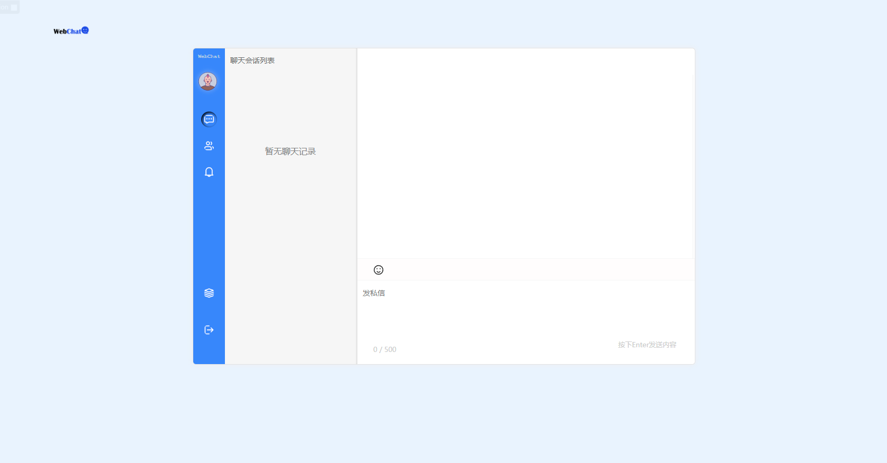
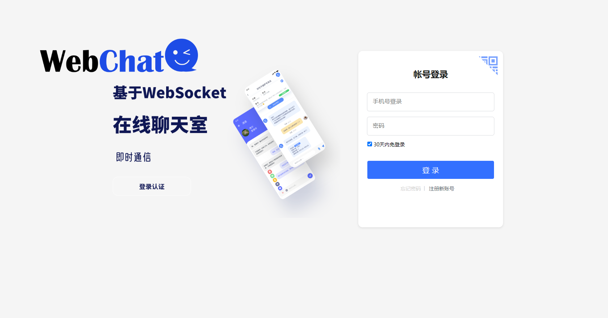
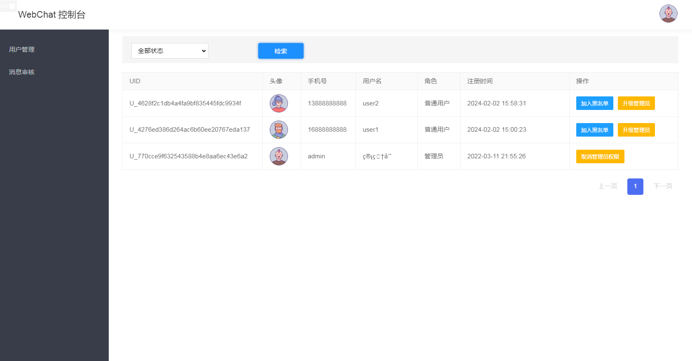
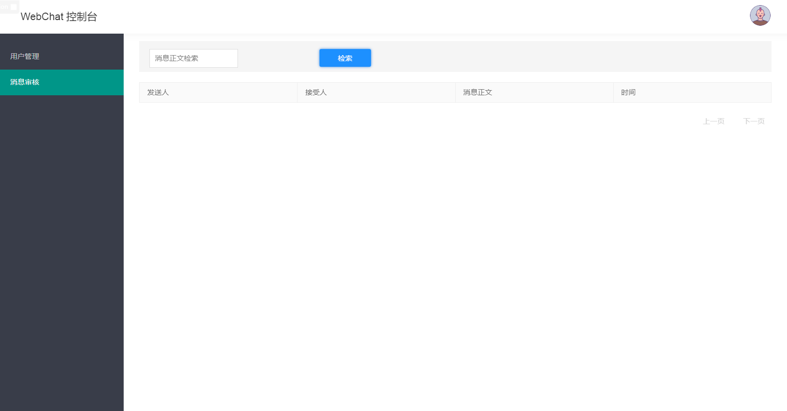

<div style="text-align:center" id="readme-top" >


Web Chat 是开源的聊天系统，支持一键免费部署私人Chat网页的应用程序。

**简体中文** · [English](./README.en.md)  · [报告问题][github-issues-link] · [请求功能][github-issues-link]

<!-- SHIELD GROUP -->

[![][github-release-shield]][github-release-link]
[![][docker-release-shield]][docker-release-link]

[![][github-forks-shield]][github-forks-link]
[![][github-stars-shield]][github-stars-link]
[![][github-issues-shield]][github-issues-link]
[![][github-license-shield]][github-license-link]

**分享 WebChat 给你的好友**

[![][share-telegram-shield]][share-telegram-link]
[![][share-weibo-shield]][share-weibo-link]
- 首页





</div>
<details>
<summary><kbd>目录树</kbd></summary>

#### TOC

- [👋🏻 开始使用 & 交流](#-开始使用--交流)
- [🛳 开箱即用](#-开箱即用)
    - [`A` 使用 Docker 部署](#a-使用-docker-部署)
    - [`B` 使用 Docker-compose 部署](#b-使用Docker-compose 部署)
    - [`C` 使用 Jar包 本地部署](#c-使用 Jar包 本地部署)
- [⌨️ 本地开发](#️-本地开发)
- [🤝 参与贡献](#-参与贡献)
- [🔗 更多工具](#-更多工具)

####

<br/>

</details>

## 👋🏻 开始使用 & 交流

WebChat目前的线上版本: https://webchat.superxiang.com 
有需求或者问题，欢迎提交 [issues][issues-link]

| [![][chat-shield-badge]][chat-link]       | 访问WebChat，快速体验                                  |
|:------------------------------------------|:------------------------------------------------|
| [![][discord-shield-badge]][discord-link] | 加入我们的 Discord 社区！这是你可以与开发者和其他 WebChat 热衷用户交流的地方 |
| [![][qq-shield-badge]][qq-link]           | 加入我们的 QQ 群！欢迎开发讨论                               |


> **收藏项目**，你将从 GitHub 上无延迟地接收所有发布通知～⭐️

## 🛳 开箱即用
> 有关 Docker
> 部署的详细说明，详见 [📘 使用 Docker 部署](https://github.com/loks666/webchat/wiki/Docker-Deployment.zh-CN)  
<br/>
WebChat 提供了  [Docker 镜像][docker-release-link]，这使你可以在几分钟内构建自己的聊天服务，无需任何基础知识。

<br/>

### `A` 使用 Docker 部署

我们提供了 Docker 镜像，供你在自己的私有设备上部署 WebChat 服务。使用以下命令即可使用一键启动 WebChat 服务：
```fish
docker run -d --name webchat -p 8101:8101 general9527/webchat:customer
```
注意：请将你的数据库root密码和redis修改为loks666，程序才能正确使用，如果你的mysql和redis都是使用容器启动的，那么需要使用--network选项来指定网络

```fish
docker run -d --name webchat --network ‘你的网络名’ -p 8101:8101 general9527/webchat:customer
```
### `B` 使用 Docker-compose 部署

[![][docker-release-shield]][docker-release-link]
[![][docker-size-shield]][docker-size-link]
[![][docker-pulls-shield]][docker-pulls-link]  

本项目目前有三个tag，分别为latest，customer和v1.0  
1. latest：打包方式为jar包打入，所以不支持修改配置:mysql和redis的密码都是loks666，mysql用户是root  
2. customer：打包方式为dockerfile打包，支持修改配置:可以修改mysql和redis的配置需添加下面的配置

```fish
   volumes:
     - ./webchat/application.yml:/src/main/resources/application.yml
     - ./webchat/application-dev.yml:/src/main/resources/application-dev.yml
```
3. v1.0：为远古版本，可以忽略  
---
- 使用项目根目录下的docker-compose 一键部署(推荐)  
注意：一键部署包含redis和mysql服务，请检查部署前是否有这两个服务

```fish
    cd webchat
    docker-compose up -d
```
- webchat 独立部署(已有mysql和redis的情况)

```fish
    version: '3.8'
    volumes:
      mysql:
      redis:
    
    services:
      webchat:
        image: general9527/webchat:customer
        container_name: webchat
        ports:
          - "8101:8101"
        volumes:
          - ./webchat/application.yml:/src/main/resources/application.yml
          - ./webchat/application-dev.yml:/src/main/resources/application-dev.yml
        networks:
          - chat_network
    
    networks:
      chat_network:
        name: chat_network
```
部署前请将application-dev.yml中redis和mysql的配置改为自己的配置

### `C` 使用 Jar包 本地部署
> 建议使用Idea插件编译打包，如果使用命令，需配置maven环境到系统环境变量中
```fish
    cd webchat
    mvn clean package
    java -jar webchat.jar
```
<br/>


## ⌨️ 本地开发

使用以下命令进行本地开发：

```fish
$ git clone https://github.com/loks666/webchat.git
$ cd webchat
$ mvn claen install
$ java -jar webchat.jar
```

<div style="text-align:right">


</div>

## 🤝 参与贡献

我们非常欢迎各种形式的贡献。如果你对贡献代码感兴趣，可以查看我们的 GitHub [Issues][github-issues-link]
和 [Projects][github-project-link]，大展身手，向我们展示你的奇思妙想。

[![][pr-welcome-shield]][pr-welcome-link]

----

## 🔗 更多工具

- [🌏 Guide][guide] : 网站导航，首页包括作者的所有作品与服务
- [🤯 Fly AI][Fly AI] : 一个无需魔法即可使用的AI网站，支持ChatGPT/LLM模型的应用程序。以及midjourney绘图等功能
- [💌 Fly API][flyapi] : 一个Open AI API KEY的分发网站，可以分享自己的key给他人使用

<div style="text-align:right">

[![][back-to-top]](#readme-top)

</div>

---

<details><summary><h4>📝 License</h4></summary>

[![][fossa-license-shield]][fossa-license-link]

</details>

Copyright © 2023 [WebChat][profile-link]. <br />
This project is [MIT](./LICENSE) licensed.

<!-- LINK GROUP -->

[github-release-shield]: https://img.shields.io/github/v/release/loks666/webchat?color=369eff&labelColor=black&logo=github&style=flat-square

[docker-release-link]: https://hub.docker.com/repository/docker/general9527/webchat/general

[docker-release-shield]: https://img.shields.io/docker/v/general9527/webchat?color=369eff&labelColor=black&logo=docker&style=flat-square

[github-forks-link]: https://github.com/loks666/webchat/network/members

[github-forks-shield]: https://img.shields.io/github/forks/loks666/webchat?color=blue&labelColor=black&style=flat-square

[github-stars-link]: https://github.com/loks666/webchat/stargazers

[github-stars-shield]: https://img.shields.io/github/stars/loks666/webchat?color=ffcb47&labelColor=black&style=flat-square

[github-issues-link]: https://github.com/loks666/webchat/issues

[github-issues-shield]: https://img.shields.io/github/issues/loks666/webchat?color=red&labelColor=black&style=flat-square

[github-license-link]: https://github.com/loks666/webchat/blob/main/LICENSE

[github-license-shield]: https://img.shields.io/github/license/loks666/webchat?color=green&labelColor=black&style=flat-square

[back-to-top]: https://img.shields.io/badge/-BACK_TO_TOP-151515?style=flat-square

[codespaces-link]: https://codespaces.new/loks666/webchat

[codespaces-shield]: https://github.com/codespaces/badge.svg

[discord-link]: https://discord.gg/gFxrcWhR

[qq-link]: https://qm.qq.com/cgi-bin/qm/qr?_wv=1027&k=547c2h6ymkB5b1WtWUBuTTJUb9Y5mh22&authKey=x3fgiRXNFNAkatyJG8%2Fyx9GAyz%2FOAnKHi%2FG3AOYhc2Ry1NKBakmuWU6BlhcGNX1M&noverify=0&group_code=134077083

[discord-shield-badge]: https://img.shields.io/discord/1127171173982154893?color=5865F2&label=discord&labelColor=black&logo=discord&logoColor=white&style=for-the-badge

[qq-shield-badge]: https://img.shields.io/badge/%E4%BA%A4%E6%B5%81%E7%BE%A4-123456789?color=5865F2&label=QQ&labelColor=black&logo=tencent-qq&logoColor=white&style=for-the-badge

[docker-pulls-link]: https://hub.docker.com/repository/docker/general9527/webchat/general

[docker-pulls-shield]: https://img.shields.io/docker/pulls/general9527/webchat?color=45cc11&labelColor=black&style=flat-square

[docker-size-link]: https://hub.docker.com/r/docker/general9527/webchat/general

[docker-size-shield]: https://img.shields.io/docker/image-size/general9527/webchat/latest?color=369eff&labelColor=black&style=flat-square


[fossa-license-link]: https://app.fossa.com/projects/git%2Bgithub.com%2Flobehub%2Flobe-chat

[fossa-license-shield]: https://app.fossa.com/api/projects/git%2Bgithub.com%2Flobehub%2Flobe-chat.svg?type=large

[github-action-release-link]: https://github.com/loks666/webchat/actions/workflows/release.yml

[github-action-release-shield]: https://img.shields.io/github/actions/workflow/status/loks666/webchat/release.yml?label=release&labelColor=black&logo=githubactions&logoColor=white&style=flat-square

[github-action-test-link]: https://github.com/loks666/webchat/actions/workflows/test.yml

[github-action-test-shield]: https://img.shields.io/github/actions/workflow/status/loks666/webchat/test.yml?label=test&labelColor=black&logo=githubactions&logoColor=white&style=flat-square

[github-contributors-link]: https://github.com/loks666/webchat/graphs/contributors

[github-contributors-shield]: https://img.shields.io/github/contributors/loks666/webchat?color=c4f042&labelColor=black&style=flat-square

[github-forks-link]: https://github.com/loks666/webchat/network/members

[github-forks-shield]: https://img.shields.io/github/forks/loks666/webchat?color=8ae8ff&labelColor=black&style=flat-square

[github-issues-link]: https://github.com/loks666/webchat/issues

[github-issues-shield]: https://img.shields.io/github/issues/loks666/webchat?color=ff80eb&labelColor=black&style=flat-square

[github-license-link]: https://github.com/loks666/webchat/blob/main/LICENSE

[github-license-shield]: https://img.shields.io/github/license/loks666/webchat?color=white&labelColor=black&style=flat-square

[github-project-link]: https://github.com/loks666/webchat/projects

[github-release-link]: https://github.com/loks666/webchat/releases/tag/latest

[github-releasedate-link]: https://github.com/loks666/webchat/releases

[github-releasedate-shield]: https://img.shields.io/github/release-date/loks666/webchat?labelColor=black&style=flat-square

[github-stars-link]: https://github.com/loks666/webchat/network/stargazers

[github-stars-shield]: https://img.shields.io/github/stars/loks666/webchat?color=ffcb47&labelColor=black&style=flat-square

[github-wiki-link]: https://github.com/loks666/webchat/wiki

[issues-link]: https://img.shields.io/github/issues/loks666/webchat.svg?style=flat

[flyapi]: https://fly.superxiang.com/

[Fly AI]: https://ai.superxiang.com

[guide]: https://guide.superxiang.com

[pr-welcome-link]: https://github.com/loks666/webchat/pulls

[pr-welcome-shield]: https://img.shields.io/badge/🤯_pr_welcome-%E2%86%92-ffcb47?labelColor=black&style=for-the-badge

[profile-link]: https://github.com/loks666/webchat

[share-telegram-link]: https://t.me/share/url?text=%E6%8E%A8%E8%8D%90%E4%B8%80%E4%B8%AA%20GitHub%20%E5%BC%80%E6%BA%90%E9%A1%B9%E7%9B%AE%20%F0%9F%A4%AF%20WecChat%20-%20%E5%BC%80%E6%BA%90%E7%9A%84%E8%81%8A%E5%A4%A9%E7%BD%91%E9%A1%B5%E5%BA%94%E7%94%A8%E3%80%82%20%E5%AE%83%E6%94%AF%E6%8C%81%E4%B8%80%E9%94%AE%E5%85%8D%E8%B4%B9%E9%83%A8%E7%BD%B2%E7%A7%81%E4%BA%BA%E7%BD%91%E9%A1%B5%E5%BA%94%E7%94%A8%E7%A8%8B%E5%BA%8F%20%23chat%20%23IM%20%23wecChat%20%23websocket&url=https%3A%2F%2Fgithub.com%2Floks666%2Fwebchat

[share-telegram-shield]: https://img.shields.io/badge/-share%20on%20telegram-black?labelColor=black&logo=telegram&logoColor=white&style=flat-square

[share-weibo-link]: https://service.weibo.com/share/share.php?sharesource=weibo&title=%E6%8E%A8%E8%8D%90%E4%B8%80%E4%B8%AA%20GitHub%20%E5%BC%80%E6%BA%90%E9%A1%B9%E7%9B%AE%20%F0%9F%A4%AF%20WecChat%20-%20%E5%BC%80%E6%BA%90%E7%9A%84%E8%81%8A%E5%A4%A9%E7%BD%91%E9%A1%B5%E5%BA%94%E7%94%A8%E3%80%82%20%E5%AE%83%E6%94%AF%E6%8C%81%E4%B8%80%E9%94%AE%E5%85%8D%E8%B4%B9%E9%83%A8%E7%BD%B2%E7%A7%81%E4%BA%BA%E7%BD%91%E9%A1%B5%E5%BA%94%E7%94%A8%E7%A8%8B%E5%BA%8F%20%23chat%20%23IM%20%23wecChat%20%23websocket&url=https%3A%2F%2Fgithub.com%2Flobehub%2Flobe-chat#_loginLayer_1706982109813

[share-weibo-shield]: https://img.shields.io/badge/-share%20on%20weibo-black?labelColor=black&logo=sinaweibo&logoColor=white&style=flat-square

[chat-link]: https://webchat.superxiang.com

[chat-shield]: https://img.shields.io/website?down_message=offline&label=vercel&labelColor=black&logo=vercel&style=flat-square&up_message=online&url=https%3A%2F%2Fchat-preview.lobehub.com

[chat-shield-badge]: https://img.shields.io/static/v1?label=WebChat&message=%E4%BD%93%E9%AA%8C%E5%9C%B0%E5%9D%80&color=45CC11&labelColor=black&style=for-the-badge&logo=chatbot

